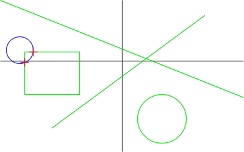

# homog2d

Current test status: [](https://github.com/skramm/homog2d/actions)

[](https://www.mozilla.org/en-US/MPL/)


[](https://github.com/skramm/homog2d/blob/master/homog2d.hpp)


A single-file header-only C++ library dedicated to
handling 2D lines, points and homographies (2D planar transformations) in Cartesian geometry,
using internally [homogeneous coordinates](https://en.wikipedia.org/wiki/Homogeneous_coordinates).
Also handles other geometric primitives, see full manual.



(see [other demos here](docs/homog2d_showcase.md))

- Language: C++14 or C++17
- Home: https://github.com/skramm/homog2d
- Usage: just fetch the file `homog2d.hpp`, put it somewhere, and "#include" it in your source file. No build!
- Status: beta
- Author: Sebastien Kramm, firstname.lastname@univ-rouen.fr
- Licence: [MPLv2](https://www.mozilla.org/en-US/MPL/2.0/)


Short preview:

```C++
#include "homog2d.hpp"
using namespace h2d;
int main()
{
	Line2d l1( Point2d(10,10) );               // a line passing through (0,0) and (10,10)
	Line2d l2( Point2d(0,10), Point2d(10,0) ); // a line passing through (0,10) and (10,0)
	auto pt = l1 * l2;                         // intersection point (5,5)
	Homogr H(2,3);                             // a translation matrix
	std::cout << H * pt;                       // prints [7,8]
}
```

### News ###
- 2023-07-11: added online Doxygen-generated reference, through the great https://codedocs.xyz/
- 2023-02-19: 2.10 release, see https://github.com/skramm/homog2d/releases
- 2023-02-12: added support for "big numbers" through the [ttmath](https://www.ttmath.org/) library, [see here](docs/homog2d_manual.md#bignum)) (preliminar!)
- 2022-12-17: moved CI tests from Travis to GH actions
- 2022-12-05: re-enabled clang compiler in test suite
- 2022-11-23: fresh 2.9 release
- 2022-09-23: passed the 1000 unit tests threshold (with `$ make test -j4 USE_TINYXML2=Y USE_OPENCV=Y`)
- 2022-08-30: added SVG import
- 2022-08-02: 2.8 release

(see [history](docs/homog2d_history.md) for more)

### Details ##

- Install: to install on your machine, copy file `homog2d.hpp` somewhere where your compiler can reach it, or `$ sudo make install` after cloning repo.
This will copy that file in `/usr/local/include`.

- Audience: any C++ dev requiring some basic computational geometry, without the burden of large scale framework.

- Usage: see [full manual](docs/homog2d_manual.md), or [Doxygen-generated pages online](https://codedocs.xyz/skramm/homog2d).

- Reference: once downloaded, enter `$ make doc` (requires Doxygen), or [read online](https://codedocs.xyz/skramm/homog2d.svg).

- A test file is provided, needs [Catch2](https://github.com/catchorg/Catch2).
When installed, run `$ make test` (or `$ make testall` for testing with all 3 numerical types).

- **Contributing**: at present, the best you can do is testing and bug/issue reporting.
Don't hesitate, this is still beta but stable release expected soon.

- Rationale:
  - Usage simplicity, max flexibility
  - No dependency [(*)](#rm_fn)
  - Modern C++, using policy-based design, tag dispatching, sfinae, ...
  - Direct bindings with other libraries ([OpenCv](https://opencv.org/), [Boost Geometry](https://www.boost.org/doc/libs/1_81_0/libs/geometry/doc/html/index.html)) (optional)

- Geometric features:
  - basic primitives: points, lines, segments, circles, rectangles, polygons, ellipse,
  - planar transformation of any of these (rotation, translation, ...),
  - computing of intersection points between these,
  - enclosing determination
  - ...

- Related libraries:
  - [CGAL](https://www.cgal.org/), the reference computational geometry library.
  - [Boost Geometry](https://www.boost.org/doc/libs/1_81_0/libs/geometry/doc/html/index.html), a highly generic library with some overlapping features (but quite harder to use)
  - [Opencv](https://docs.opencv.org/), the reference CV library, much more algorithms, but no direct support for homogeneous geometry.
  - [Wykobi](http://www.wykobi.com/), has much more computational geometry features but no direct support for homogeneous geometry.

**Warning**: The images shown in the manual are there just there as an illustration of what the library does, but there is **no rendering code** included.
The library provides drawing function whose implementation requires external code.
The images are drawn either as Svg files, or using a third-party library (Opencv), but the latter is not needed to use this library.


(*):
<a name="rm_fn"></a>
Except for some additional features, see [manual](docs/homog2d_manual.md).
