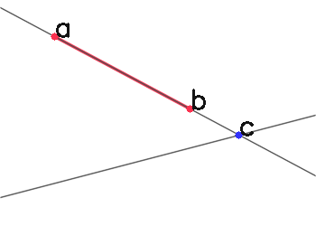
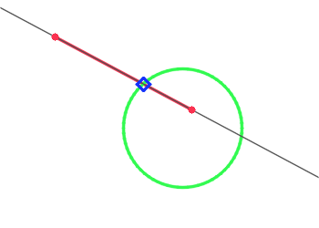
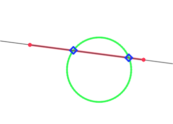
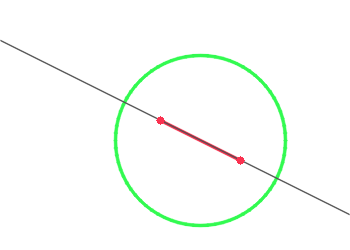

# Information on used algorithms

[Manual main page](homog2d_manual.md)

This page will give some details on how things are done.

## 1 - Intersection algorithms

### 1.1 - Line/Line, Line/Segment, Segment/Segment

For Line/Line intersection, this simply checks that lines are not parallel and if not, it returns the intersection point,
defined as the product of the two lines.

For Segment/Line, we first fetch the supporting line of the segment, and compute the intersection point using the above function.
Then, we check if the intersection point is lying on the segment.

This is done by computing the sum of the two distances between the two points of the segment and the intersection point, and comparing that value to the segment length.
If it is higher than the segment length, then the intersection point does not cross the segment.

Consider for example the figure below:



We compute the distances d(ac) and d(bc).
Here, their sum is obviously higher than the segment length, thus there is no intersection between segment `[ab]` and the line.

For Segment/Segment, the checking is done twice, once for each segment.

A threshold is used to compare theses distances, the computation is actually (pseudocode):
```
if( | d(ac) + d(bc) - segment_length | < thr::nullDistance() )
	... then intersection point
```

See [page on thresholds](homog2d_thresholds.md) for details on how to manage the threshold value.

### 1.2 - Line / Circle

We use here a geometric approach, described in [this document](http://skramm.lautre.net/files/misc/intersect_circle_line.pdf).
This basically restates what is [described here](https://cp-algorithms.com/geometry/circle-line-intersection.html).


### 1.3 - Segment / Circle

The first step is to check if the segments supporting line has an intersection with the circle, using the above algorithm.
  * If there is no interesection, then we can stop.
  * If these is one, then several situations need to be considered:





We first determine the status of each point of the segment: are they inside or outside(*) of the circle.

  * If the two points are inside, then there are no intersections.
  * If the two points are outside, then we have two intersection points, that are computed with the algorithm described above.
  * If one point is inside and the other outside, then we have only one intersection.
Determining which one of the two points is the correct one if done by checking which point of the segment is inside the circle.

(*) for clarity, we do not detail here the case where points are on the edge of the circle, but this is taken into account in the code.


### 1.4 - FRect / FRect

Each segment of one of the rectangles if compared to each segment of the other rectangle.
Thus we have between 0 and 4 intersections (equal intersection points are removed).


## 2 - Enclosing algorithms


### 2.1 - Point inside Polygon

The algorithm will provide an answer to the question "is this point 'p' inside this polygon".
So first, as polygons are implemented through the class `CPolyline_`, it will return `false`
if it does not meet the "polygon" requirements (i.e. if there are some segments crossings, or if the polyline is not closed).

The code uses the classical "ray casting" algorithm
(see https://en.wikipedia.org/wiki/Point_in_polygon):
the algorithm states to build a segment going from the considered point to infinity, and count the number of intersections.
It it is even, the point is outside, else it is inside.

However, while mathematically exact, this algorithm needs to be implemented with caution, to avoid numerical issues.
The most important point is how do we select the "outside" (infinity) point 'px'.

- First, we check if the point 'p' is outside the bounding box of the polyline.
This implies that the point is not inside, thus we return `false`.
- Second, we build the "extended" bounding box and search for a suitable point lying on its edges.
What we want to avoid is selecting a point 'px' so that a segment [p,px] will intersect with one of the points of the polygon.
Because if it does, it will generate two crossings where there oughta be only one.

So the implementation sets up an iterative method:
starting with the extended bounding box (see FRect_::getExtended() ), we take each of the associated segments and check if taking the middle point as "reference" point does the job (i.e. the reference segment is far enough from all points of the polygon).
If not, we check the following.
If none of the segments fit, we double the number of segments by splitting each of them, and reiterate, until we find a suitable point on the extended BB edge to build our reference segment.

Of course, their must be a stopping criterion for this iterative method.
The number of iterations is determined by the symbol `HOMOG2D_MAXITER_PIP` (default value = 5), that you can define.
If the function is unable to find a "good" reference segment after that threshold, it will throw an error.

The allowed distance between a given reference segment and one of the points of the polygon is given by `thr::nullDistance()`, that you may also adjust if necessary (see [homog2d_thresholds.md](homog2d_thresholds.md)).


