# Manual

Home page: [github.com/skramm/homog2d](https://github.com/skramm/homog2d)

This is the manual for the current master branch of `homog2d`.
For stable releases, see https://github.com/skramm/homog2d/releases .

1. [Introduction](#intro)
2. [Lines and points](#basic)
3. [Other geometric primitives](#shapes)
4. [2D transformation (aka homographies)](#matrix)
5. [Intersections and enclosings determination](#inter)
6. [Misc. features](#misc)
7. [Bindings](#bind)
8. [Drawing things](#drawing)
9. [Numerical data types](#numdt)
10. [SVG import](#svg_import)
11. [Technical details](#tech)
12. [FAQ](homog2d_qa.md)
13. [History](homog2d_history.md)

## 1 - Introduction
<a name="intro"></a>

All the code is in the namespace `h2d`, so either add `using namespace h2d;`, either use it as a prefix on each type.

This library provides several main data types: lines, points, segments, circles, ellipses, polyline and homography matrices.
These can be used to transform one of the basic types (planar transformation).
It is implemented as a homogeneous 3x3 matrix.

All the data types implement a comparison operator ( `==` and  `!=`).

This library does not provide exact arithmetic, it relies instead on basic floating-point types for storage and computations, but user can select the underlying type.
The types are fully templated by the underlying numerical type.
To make things simple, we introduce here only the default type, based on `double` (see [Numerical data types](#numdt) for details).

The API is exposed both as member functions and as free functions.
Say for example you have a type `AAA` on which you can apply the `foo()` operation.
Both of these are possible:
```C++
AAA myvar;
auto v1 = myvar.foo();
auto v2 = foo(myvar);
```

## 2 - Lines and points
<a name="basic"></a>

### 2.1 - General usage

- Create or edit a 2D point:
```C++
Point2d pt1;       // 0,0
Point2d pt2(3,4);
pt1.set( 5, 6 );
```

- Create a 2D line:
```C++
Line2d li1;             // vertical line at x=0
Line2d li2( 3, 4 );     // line passing through (0,0) and (3,4)
Line2d li3( LineDir::H, 15 ); // horizontal line at y=15
Line2d li4( LineDir::V, -2 ); // vertical line at x=-2
```

- For horizontal or vertical lines, you can also just provide a point, the constructor will handle it:
```C++
Point pt(x,y)
Line2d liH( LineDir::H, pt );
Line2d liV( LineDir::V, pt );
```

- Create a point from two lines, and a line from two points:
```C++
Point2d pt3( li1, li2 );
Line2d  li3( pt1, pt2 );
```

- Get a line from two points, and a point from two lines:
```C++
auto pt = li1 * li2;
auto li = pt1 * pt2;
```

Beware, two parallel lines will never cross, and two identical points do not define a line.
So if your code attempts to do so, this will trigger a
[std::runtime_error](https://en.cppreference.com/w/cpp/error/runtime_error)
exception.<br>
If you are unsure, you can check first:
```C++
if( li1.isParallelTo(li2) )
	cout << "Lines are parallel !\n";
if( pt1 == pt2  )
	cout << "Points are identical !\n";
```

For the numerical considerations on this,
check below, section [Numerical data types](#numdt).


To get the euclidean coordinates of a point, two member functions are provided:
```C++
auto x = pt.getX();
auto y = pt.getY();
```
Or use the equivalent free functions:
```C++
auto x = getX(pt);
auto y = getY(pt);
```

This library is designed to handle points at infinity, you can check if they are:
```C++
Point2d pt(1,2,0);
assert( pt.isInf() );
```

To get the 3 components of a line as a homogeneous array, one may use:
```C++
auto v = line.get();
std::cout << '[' << v[0] << ',' << v[1] << ',' << v[2] << '\n';
```

But if its about printing, then the easiest is to use the overloaded operators:
```C++
Line2d li;
std::cout << li << '\n';
```
(BTW: this is the same for all the other primitives, points and others).

- Compute distances from line to point or from point to point:
```C++
Line2d li;        // some line
Point2d pt1, pt2; // some points
auto dist1 = li1.distTo( pt1 );   // distance from line to point
auto dist2 = pt1.distTo( li1 );   // but you can do this too
auto dist2 = pt2.distTo( pt1 );   // distance from point to point

Line2d li2;
// auto dist = li.distTo( li2 );   // this does not build !
```

For points, you may also use the corresponding free function:
```C++
Point2d pt1, pt2;          // some points
auto d = dist( pt1, pt2 );
```

You can compute the segment generated by a point and a line, using the shortest distance:
```C++
Line2d line;
Point2d pt;
auto seg_orth = line.getOrthogSegment( pt );
```
This is illustrated on this figure, showing a rotating point and the computed orthogonal segment to a line
([source](../misc/showcase/showcase8.cpp)):

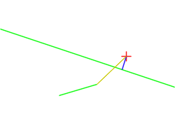


### 2.2 - Get point(s) lying on line

To get a point lying on a line, you can provide one of its coordinates and get the other coordinate value, using the enum
`GivenCoord`.
For example, if you build the line going through (0,0)-(4,2) with:

```C++
Line2d li(4,2);
```
You can compute the coordinate of y for x=2 with:
```C++
auto y = li.getCoord( GivenCoord::X, 2 );
```
or get the coordinate of x for y=1 with:
```C++
auto x = li.getCoord( GivenCoord::Y, 1 );
```

You can also get directly the point with:
```C++
Point2d pt2 = li.getPoint( GivenCoord::X, 2 );
```

Some care has to be taken with these functions, because they will throw if unable to provide a result.
For example, if you try to get the 'y' coordinate from a vertical line, this will fail.
The following code will throw:

```C++
Line2d li;
auto y = li.getCoord( GivenCoord::X, 0 );
```

### 2.3 - Points at equal distance from a point on line
<a name="paedfapol"></a>

You can compute the two points that are lying on a line and at a given distance from a point.


The API provides two ways to get these:

- either you provide the x or y coordinate of p0:
```C++
Line2d li( ..., ... ); // some line
auto ppts = li.getPoints( GivenCoord::X, coord, dist ); // returns a std::pair
Point2d p1 = ppts.first;
Point2d p2 = ppts.second;
```
The drawback is same as the above paragraph: if line is vertical/horizontal (or near), these can fail.

- either you provide directly the point:
```C++
Line2d li( ..., ... ); // some line
Point2d pt_on_line;
auto ppts = li.getPoints( pt_on_line, dist ); // returns a std::pair
```
The drawback is that you need to be sure that this point is truely on the line.
This will be checked for, and library will throw if not
(except if error checking is disabled, see [build options](#build_options)).

Upon return, the "first" point will hold the one with smallest 'x' coordinates, or the smallest 'y' coordinates if x coordinates are equal.

### 2.4 - Orthogonal and parallel lines, angles between two lines

You can compute a line orthogonal to another one at a given coordinate, using the above enum.
For example, this:
```C++
auto lB = lA.getOrthogonalLine( GivenCoord::X, x1 );
```
will build `lB` so that it is orthogonal to `lA` at `x=x1`.

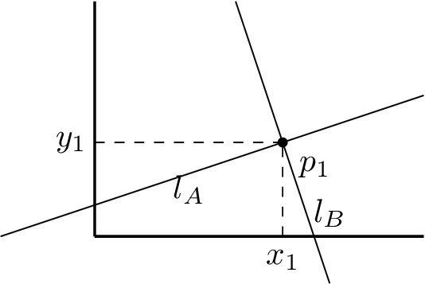

Similarly, you can also directly use as input a point on the line:
```C++
Line2d liB = lA.getOrthogonalLine( p1 );
```
Again, point is checked and this will throw if distance from point to line is above some threshold
(see ["numerical issues"](#num_issues)).


You can get a line parallel to another one with the member function `getParallelLine()`.
This function takes as argument a point that the line will intersect.

```C++
Line2d li1; // some line
Point2d pt; // some point
auto li2 = li1.getParallelLine( pt ); // pt will be lying on li2, wich is parallel to li1
```

If you need a parallel line to another at a given distance, then you can use
`getParallelLines()`, provided either as a free function or as a member function.
They both return a pair (`std::pair`) of lines, one on one side, and the other on the other side of the input line:
```C++
Line2d li; // some line
auto p_lines1 = li.getParallelLines( 100 );
auto p_lines2 = getParallelLines( li, 50 ); // free function
auto liA = p_lines1.first;
auto liB = p_lines1.second;
```

If you know that two lines are parallel and you want the distance between them, then you have:
```C++
auto dist = getParallelDistance( li1, li2 );
```
This will throw if lines are not parallel.

You can compute the angle in Radians between two lines, either with a member function or with a free function:
```C++
auto angle1 = li2.getAngle( li1 );
auto angle2 = getAngle( li1, li2 ); // free function
```

You can rotate a line at a given point (must be lying on the line):
```C++
auto li1 = pt1 * pt2;
auto li2 = li1.getRotatedLine( pt1, angle /* in rads */ );
```


## 3 - Other geometric primitives
<a name="shapes"></a>

Besides points and lines, the following primitives are provided:
* [segment](#p_segment)
* [flat rectangle](#p_frect)
* [circle](#p_circle)
* [polyline](#p_polyline)
* [ellipse](#p_ellipse)

The ones that may cover some area (polyline, ellipse, circle) provide a function `getBB()` that returns a [flat rectangle](#p_frect) holding the bounding box.
This is not available for points, lines, and segments (as a segment can be vertical or horizontal, it does not have an area).

On this figure, you can see a circle, a polyline and and ellipse, along with their corresponding bounding boxes.
For the ellipse, you can get both the axis-aligned bounding box (shown in blue here), and the ellipse-axis aligned bounding box, shown in green.


Besides these, you can also get the bounding box of two arbitrary primitives `p1`,`p2`, even of different types, with a free function:

```C++
auto bb = getBB( p1, p2 );
```

On this figure, you can see three combinations of bounding boxes for some objects.


### 3.1 - Segments
<a name="p_segment"></a>

A segment is implemented internally as a pair of points.
Usage is straightforward:
```C++
Segment s1( Point2d(12,34), Point2d(45,67) );
Segment s2; // default value
std::cout << s2;  // prints "(0,0) - (1,1)"
s2.set( Point2d(12,34), Point2d(45,67) );
```

You can also build the segment by giving the 4 coordinates, x1,y1 and x2, y2 of the two points.
The only constraint is that they must be all of the same type (no int/float/double mix):
```C++
Segment s1( x1, y1, x2, y2 );
```

It can also be initialized (or set) with a pair of points:
```C++
auto ppts = std::make_pair( Point2d(4,5), Point2d(2,1) );
Segment s1( ppts );
s1.set( ppts );
```

Besides using a homography matrix, translating the segment can be done with a member function:
```C++
Segment s1( ... );
s1.translate( dx, dy );
```

You can get the pair of points (as an `std::pair`) with `getPts()`.
Internally, the points are stored with the "smallest" one as first (using x coordinate, or, if equal, using y coordinate):
```C++
Segment s1( Point2d(100,100), Point2d(10,10) );
auto pair = s1.getPts();
std::cout << pair.first; // will print (10,10)
```

Many operations available with lines apply to segments too:
```C++
Segment s1( Point2d(12,34), Point2d(45,67) );
Line2d l1  = s1.getLine();  // get supporting line
Line2d l12 = getLine(s1);   // or with free function
bool b1 = l1.isParallelTo( s1 );
bool b2 = s1.isParallelTo( l1 );  // also works
auto a1 = l1.getAngle( s1 );
auto a2 = s1.getAngle( l1 );
```

You can get the point lying in the middle of the segment:
```C++
Segment s1( Point2d(1,2), Point2d(3,4) );
auto p_middle = s1.getCenter(); // or: getCenter(s1)
```

This middle point can be used to split a segment into two equal length segments,
returned as a `std::pair`:
```C++
Segment seg( Point2d(1,2), Point2d(3,4) );
auto p_segs = seg.split(); // or: split(seg)
```

The bisector line is available, using a member or free function:
```C++
Segment seg( Point2d(1,2), Point2d(3,4) );
auto line1 = seg.getBisector(); // or: getBisector(seg)
```

You can generates a `std::pair` of two parallel segments, lying at a distance `dist`, with:
```C++
Segment seg( pt1 , pt2 );
auto p_segs = seg.getParallelSegs(dist); // or: getParallelSegs(seg,dist)
```

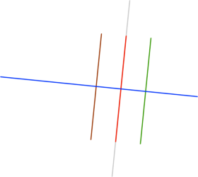

The length is available with a member function or a free function:
```C++
Segment seg( Point2d(1,2), Point2d(3,4) );
auto length  = seg.length(); // or: length(seg)
```

The extended segment is available with a free of member function:
```C++
Segment seg( pt1, pt2 );
auto seg_ext = seg.getExtended(); // or getExtended(seg);
```
The extended segment has the same support line, but is "extended" on both sides with the length of the segment.
Thus its length is three times the original segments length.
On the figure below, the original segment is blue and the extended segment is red.
The support line is gray.

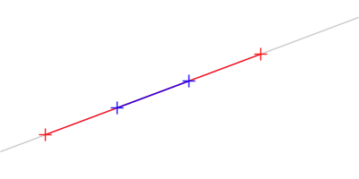

The distance between a segment and a point can be computed.
The code considers the different situations:
shorted distance can be the orthogonal distance to the supporting line, or the distance to one the two points.
```C++
Point2d pt;
Segment seg;
auto dist = set.dist( pt );
```
This function has an optional second argument:
a pointer to an int, that will hold upon return one of these three values:
 * 0: distance is the orthogonal distance to the support line
 * +1: distance is the one between point and smallest point of the segment
 * -1: distance is the one between point and largest point of the segment

See [showcase8](homog2d_showcase.md#sc8) for an illustration.

### 3.2 - Flat rectangles
<a name="p_frect"></a>

A flat rectangle is provided through the class `FRect`.
It is modeled by its two opposite points.
```C++
FRect r1; // (0,0) (1,1)
FRect r2( Point2d(0,0), Point2d(10,10) );
r1.set( pt1, pt2 );
```
When using the constructor or the `set()` member function, there is no constraint on the points themselves:
the library will automatically adjust the points to store the two opposite ones,
with the one with smallest coordinates as "first".

This means you can give either (p0,p1) or (p2,p3), only p0 and p1 will be stored:

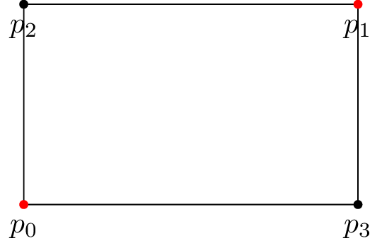

The only constraint is that no coordinate can be equal.
The function will throw if it is not enforced.

You can also build the rectangle by giving the 4 coordinates x1,y1 and x2,y2.
The only constraint is that they must be all of the same type (no int/float/double mix).
```C++
FRect r1( x1, y1, x2, y2 );
```

Or by giving the center point and width and height:
```C++
FRect r1( p0, w, h );
```

Or by providing a `std::pair` of points:
```C++
std::pair<Point2d,Point2d> ppts = std::make_pair( Point2d(0,0), Point2d(10,10) );
FRect rect( ppts );
```

You can get the points with two different member functions:
```C++
FRect rect( pt1, pt2 );
auto pair_pts  = rect.getPts();  // returns the 2 points p0,p1 in a std::pair
auto pair_pts2 = getPts(rect);   // or use the free function
auto pts  = rect.get4Pts();      // return a std::array of 4 points
auto pts2 = get4Pts(rect);       // or use the free function
```

You can also fetch the 4 segments of the rectangle, with a member function or a free function:
```C++
FRect rect( pt1, pt2 );
auto segs = rect.getSegs(); // returns a std::array of 4 segments.
auto segs2 = getSegs(rect); // your choice
```

The two diagonal segments can be fetched with, as a pair of segments:
```C++
FRect rect( pt1, pt2 );
auto psegs = rect.getDiagonals();  // or: getDiagonals(rect);
```
The `first` element will hold the point with minimal coordinates.


And of course, its width, height, length, and enclosed area.
This is available through member functions or free functions.
```C++
FRect rect;
auto w = rect.width();
auto h = rect.height();
auto a = rect.area();   // w * h
auto l = rect.length(); // 2*w + 2*h
// or free functions
auto w2 = width(rect);
auto h2 = height(rect);
auto a2 = area(rect);
auto l2 = length(rect);
```

You can gets its size as a pair of values (member function or free function),
with the width as `first` element and height as `second` element:
```C++
FRect rect;
auto s1 = rect.size();   // or: size(rect);
```

It is possible to translate the rectangle using some dx,dy offset:
```C++
FRect rect;
rect.translate( dx, dy );
```

you can get the circle that passes through the 4 points:
```C++
FRect r1(...); // whatever
auto c1 = r1.getBoundingCircle(); // or: getBoundingCircle(r1);
```

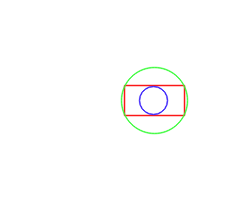


The extended flat rectangle is available with a free of member function:
```C++
FRect  r1( pt1, pt2 );
auto rect_ext = r1.getExtended(); // or getExtended(r1);
```
The extended flat rectangle will have an area 9 times the area of original rectangle.

The diagonal segments are available with a call to a member or free function:
```C++
FRect  r1( pt1, pt2 );
auto p_diags = = r1.getDiagonals(); // or getDiagonals(r1);
```

The figure below shows the extended rectangle and the diagonals.
red: the original rectangle, blue: the extended one, green: the diagonal segments, and gray: the supporting lines
([source file](../misc/figures_src/src/frect_extended.cpp)).


### 3.3 - Circles
<a id="p_circle"></a>

These are modeled by their center point and radius.
Creation is straightforward, whathever your needs:
```C++
Circle c1;                          // at (0,0), radius = 1
Circle c2( center_point );          // radius = 1
Circle c3( center_point, radius );
Circle c4( x0, y0, radius );
```

Similarly, you can assign values to an existing circle:
```C++
c1.set( x0, y0, radius );
c2.set( center_pt, radius );
c3.set( radius );            // center doesn't change
c4.set( center_pt );         // radius doesn't change
```

You can also compute the unique circle from points,
either from 2 points (that define the diameter), or from 3 points:
```C++
Circle c1( pt1, pt2, pt3 );
// or
c1.set( pt1, pt2, pt3 );

Circle c2( pt1, pt2 );
// or
c2.set( pt1, pt2 );
```
For these latter functions, the 2 (or 3) points must be different, and not colinear (for 3 points).
This is checked for and will throw if not the case
(unless the "no checking" build option is activated, (see here)[#build_options]).


Center and radius can be accessed (read/write) with provided member functions:
```C++
Circle c1;
c1.radius() = 100;
std::cout << c1.radius();  // prints '100'
c1.center() = Point2d(12,34);
std::cout << c1.center(); // prints '[12,34]'
```
Corresponding free functions are also provided:
```C++
radius(c1) = 100;
std::cout << radius(c1);  // prints '100'
center(c1) = Point2d(12,34);
std::cout << center(c1); // prints '[12,34]'
```

You can get area and perimeter with member or free functions.
The perimeter function has the name "length" for consistency with other primitives.
```C++
auto area  = c1.area();   // or: area(c1)
auto perim = c1.length(); // or: length(c1)
```

Two additional free functions provide the segment (or line) between the centers of two circles,
and the two segments tangential to two circles:
```C++
Circle c1, c2;
auto seg = getSegment( c1, c2 );  // as a segment
auto line = getLine( c1, c2 );    // as a line
// same result than: getSegment( c1, c2 ).getLine();
auto pair_segs = getTanSegs( c1, c2 ); // std::pair of Segment
```


### 3.4 - Polyline
<a name="p_polyline"></a>

This class holds a set of points and models an arbitrary set of joined segments, without orientation.
It is available as two classes `OPolyline_` (open) and `CPolyline_` (closed).

The closed one automatically considers a connection betwen last and first point.
It can be used to model a polygon.

```C++
OPolyline pl1; // empty
CPolyline pl2;
std::vector<Point2d> vpts;
// fill vpts
pl1.set( vpt );      // sets the points
pl2.set( vpt );      // sets the points
```

It can be initialised either with a container holding the points, or (only for the closed version) from a `FRect`:
```C++
std::vector<Point2d> vpts{ {0,0},{1,1},{3,1} };
OPolyline op(vpts);
CPolyline cp(vpts);
FRect rect( .... );
CPolyline cp2(rect);
// OPolyline op2(rect); // this does not build
```


Warning: you may not add a point identical to the previous one.
Whatever the type, this code will throw:
```C++
std::vector<Point2d> vpts{ {0,0},{1,1},{3,1},{3,1} };
OPolyline op(vpts);
CPolyline cp(vpts);
```

The minimum number of points is 2, initializing with a vector holding 1 point will throw.

The `getBB()` member (or free) function return the corresponding Bounding box, shown here in gray, for two `Polyline` objects, one closed, the other open:


The open/close attribute can be read, but will return a `constexpr` value:
```C++
OPolyline p1;
CPolyline p2;
auto b1 = p1.isClosed(); // always false
auto b2 = p2.isClosed(); // always true
```

Both types provide access to basic attributes:
number of points, number of segments, length, and bounding box, all available as member or free functions:
```C++
auto n1 = pl.size();  // nb of points
auto n2 = size(pl);
auto s1 = pl.nbSegs(); // nb of segments
auto s2 = nbSegs(pl);

auto length1 = pl.length(); // or  length(pl);
auto rect1 = pl.getBB();    // or  getBB(pl);
```

It has no orientation, meaning that the `OPolyline` build from this set of points:<br>
`(0,0)-(1,0)-(1,1)`<br>
will be identical as this one:<br>
`(1,1)-(1,0)-(0,0)`

You can extract either points or segments.
The number of segments is related to the open/close condition.
For example, if we have 4 points, that will generate 4 segments if closed, but only 3 if the polyline is open.
```C++
std::cout << "nbpts=" << pl.size() << " nb segments=" << pl.nbSegs() << '\n';
auto vec_pts  = pl.getPts();
auto vec_segs = pl.getSegs();
auto pt = pl.getPoint( i );   // will throw if point i non-existent
auto seg = pl.getSegment( i );   // will throw if segment i non-existent
```

You can check if it fullfilths the requirements to be a polygon (must be closed and no intersections).
If it is, you can get its area and its centroid point:
```C++
CPolyline pl;
// ... set points
if( pl.isPolygon() ) {  // or : if( isPolygon(pl) )  (free function)
	std::cout << "area=" << pl.area();
	std::cout << "centroid point=" << pl.centroid();
}
```

Please note that if not a polygon, or if applied on a open type, then the `area()` function will return 0
but the `centroid()` function will throw.

For closed types, you can determine its convexity:
```C++
CPolyline plo;
OPolyline plc;
// ... set points
std::cout << pls.isConvex() ? "is convex\n" : "is NOT convex\n"; // or free function: isConvex(plc)
assert( !plo.isConvex() ); // open is not a polygon, so it can't be convex
```

#### Comparison of Polyline objects

Polyline objects can be compared, however the behavior differs whether it is closed or not.
Consider these two sets of points:
```
(1,1)--(3,4)--(1,3)
(3,4)--(1,3)--(1,1)
```

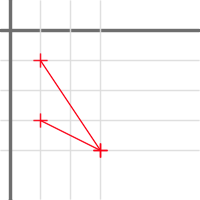
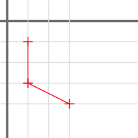
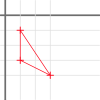

If they are not closed, then the `==` operator will return `false`.
But if they are (both) closed, it will return `true`, as they obviously describe the same polygon.

This is handled through a normalization step, called automatically.
  * if "closed" type, the normalization will reverse and rotate the points, so that the smallest point is first and the second one is smaller than the last one.
  * if "open" type, only the reverse operation is performed.

However, comparison of identical objects can fail in some circumstances, because a Polyline object can hold the same point several times (but not contiguous).
Consider these two closed Polyline objects:

A: `(0,0)-(3,0)-(3,1)-(0,0)-(0,3)-(1,3)`<br>
and<br>
B: `(3,0)-(3,1)-(0,0)-(0,3)-(1,3)-(0,0)`

They both describe the same object:
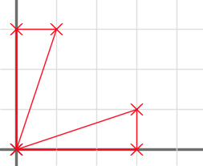

When compared, they will be considered as different because they both use twice the same point `(0,0)`
and their normalisation will produce these sets of points:<br>
A: `(0,0)-(3,0)-(3,1)-(0,0)-(0,3)-(1,3)` (unchanged)<br>
B: `(0,0)-(0,3)-(1,3)-(0,0)-(3,0)-(3,1)`

For more details, see [homog2d_Polyline.md](homog2d_Polyline.md).


### Rotation/mirroring

All the primitives can be rotated using a homography (see following section), but in some situations you only need "quarter-circle" rotations (mutiples of 90°).
While it is of course possible to proceed these rotations with a homography, the downside is that you may end up with 0 values stored as `1.359 E-16`,
due to numerical nature of floating point computation.
This can be undesirable, so an alternative is provided:
You may rotate/mirror all the points of polyline objects with the `rotate()` member function.
it takes as argument an enum value of type `Rotate`.

The available values are:
* `CW`: -90° (Clockwise)
* `CCW`: +90° (Counter Clockwise)
* `Full`: 180°
* `VMirror`: Mirror points relatively to vertical axis
* `HMirror`: Mirror points relatively to horizontal axis

```C++
Cpolyline poly;
// ... fill with points
poly.rotate( Rotate::CW ); // or free function: rotate( poly, Rotate::CW );
```

These operations are done relatively to the origin `(0,0)`.
If you need a rotation on a specific plane location, you may pass that location as second argument:

```C++
Cpolyline poly;
// ... fill with points
Point2d org( ..., ... );
poly.rotate( Rotate::CW, org ); // or free function: rotate( poly, Rotate::CW, org );
```

### 3.5 - Ellipse
<a name="p_ellipse"></a>

We follow here the traditional parametrization of ellipses:
center point, semi-major (a) and semi-minor (b) distances, and angle between main axis and horizontal axis.
Internally, it is stored as a conic in its matrix form (see [build options](#build_options) for details).

_Warning: support for ellipse is only partial at present, several features available with all the other primitives may not
all be available for this type_

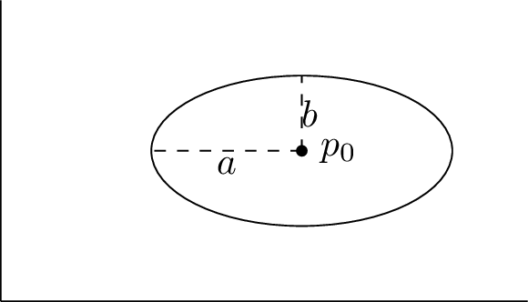

It can be build using several constructors:

```C++
Ellipse ell;  // centered at (0,0), with null angle, major=2 minor=1
Ellipse ell2( x0,y0 ); // same as above, but centered at (`x0`,`y0`)
Point pt( ..., ... );
Ellipse ell3( pt ); // same as above, but centered at `pt`
Ellipse ell4( pt, major, minor, angle ); // all parameters given (angle has 0 as default value)
Circle cir;
Ellipse ell5( cir );  // can be initialized from a circle
```

Retrieving attributes
(The perimeter function has the name "length" for consistency with the other primitives):
```C++
Ellipse ell;
auto center  = ell.center(); // or: center(ell)
auto angle   = ell.angle();  // or: angle(ell)
auto area    = ell.area();   // or: area(ell)
auto perim   = ell.length(); // or: length(ell)

auto majmin  = ell.getMajMin();  // returns a pair of floating point values
```

Two functions are provided to get the bounding box:
as with the others primitives, the
`getBB()` member function returns the "flat" bounding box,
while the `getOBB()` returns the "oriented" bounding box as a [closed polyline](#p_polyline) object.

These are also available as free functions:
```C++
Ellipse ell;
auto bb  = getBB(ell);
auto obb = getOBB(ell);
```

You can get the pair of axis lines:
```C++
Ellipse ell;
auto pair_lines  = ell.getAxisLines();
auto pair_lines2 = getAxisLines( ell ); // or use the free function
```

To check if the ellipse is a circle:
```C++
Ellipse ell;
bool b = ell.isCircle();
```
(An ellipse will be a circle if a=b, but as it is stored in the matrix form, we check here if A=C and B=0.

This will use a threshold, but you can provide the one you want, depending on your applications constraints:
```C++
Ellipse ell;
bool b = ell.isCircle(1E-15);
```

There is also a free function available:
```C++
bool b1 = isCircle( ell );
bool b2 = isCircle( ell, 1E-15 );
```


## 4 - Homographies
<a name="matrix"></a>

You can manipulate 2D transformations as 3x3 homogeneous matrices (aka "Homography"), using the class `Homogr`.


### 4.1 - Homographies for points

```C++
Homogr h; // unit transformation ("eye" matrix)
h.setTranslation(3,4);
Point2d pt1(1,2);
Point2d pt2 = h * pt1; // pt2 is now (4,6)
h.init(); // reset to unit transformation
```

This can also be used with all the other types (`Segment`, `FRect`, `OPolyline`, `CPolyline`, `Circle`, `Ellipse`):
```C++
Homogr h;
 ... assign some planar transformation
Segment s1( ..., ... );
auto s2 = H * s1;

Polyline pl;
pl = H * pl;

auto a = H * rect; // a is a CPolyline
```
It must be noted that due to the inherent projective nature of a homography, applying to a flat rectangle will not produce a rectangle but a `CPolyline`.
Similarly, applying a homography to a `Circle` will generate an `Ellipse` object:

```C++
FRect r1;
auto r2 = Homogr() * r1;
Circle c1;
auto c2 = Homogr() * c1;
cout << "r2 type=" << getString( r2.type() ) << '\n'; // will print "CPolyline"
cout << "c2 type=" << getString( c2.type() ) << '\n'; // will print "Ellipse"
```

### 4.2 - Homographies for lines
<a name="line_homography"></a>

For lines, a known result is that if we have a line `lA` going through `p1` and `p2`,
and a homography `H` mapping `p1` and `p2` to `p'1` and `p'2`, then the line `lB` joining these
two points can be computed with `lB = H^-T lA`.
<br>
Since release 2.4, this library automatically handles this inversion, inside the class:
```C++
Homogr h;
 ... assign some planar transformation
Point2d p1a( ..., ... );
Point2d p2a( ..., ... );
Line2d lA = p1a * p2a;
auto p1b = H * p1a;
auto p2b = H * p2a;
lB = H * lA; // same as lB = p1b * p2b;
```

### 4.3 - Setting up from a given planar transformation

The three planar transformations (rotation, translation, scaling) are available directly through provided member functions.
They are available in two forms: "`setXxxx()`" and "`addXxxx()`".
The first one starts from the identity transformation and builds the requested one.
The second form adds the requested transformation to the matrix.

- You can create a rotation or a scale transformation with one of these:
```C++
Homogr h;
h.setRotation( 3.14 ); // angle of PI radians
h.setScale( 2., 3. ); // discard previous rotation, and set horizontal scale factor to 2. and vertical to 3.
```

- You can build some complex transformation by multiplying these:
```C++
Homogr h; // unit transformation
h.setTranslation(3,4);
Homogr h2( 45. * M_PI / 180.); // 45° rotation matrix
auto h3a = h1*h2; // first, rotation, then translation
auto h3b = h2*h1; // first, translation, then rotation
```

- Or by calling dedicated member functions:
```C++
Homogr h;
h.addRotation( 3.14 );       // angle of PI radians (would be identical with "set")
h.addScale( 2., 3. );        // add scaling transformation
h.addTranslation( 0., 4. );  // add translation
```

- But you can also used "chained" syntax:
```C++
Homogr h; // unit transformation
h.addTranslation(3,4).addRotation( 45. * M_PI / 180.).addTranslation(-3,-4);
```

- You can access individual values of the matrix (read or write).
This is needed if you want to set up some specific transformation (shearing, perspective, whatever):
```C++
h.set( 0, 0, 3.14 );  // sets value at first line, first col
auto v = h.get( 0, 0 ); // 3.14
```

To fill the matrix with arbitrary values, the best is to build it from a "vector of vectors", as in the example below:
```C++
std::vector<std::vector<float>> m = {
	{ 1,  0,  2 },
	{ 0,  1, -1 },
	{ 0,  0,  1 }
};
Homogr F = m;
```
You can also use `std::array` if needed.

- You can compute the inverse and/or the transpose of the matrix:
```C++
h.inverse();
h.transpose();
h.inverse().transpose(); // first, invert, second, transpose
```
(note: inversion is done by first computing its corresponding [adjugate matrix](https://en.wikipedia.org/wiki/Adjugate_matrix).)


- Once you have set up your matrix, you can apply it to points (or lines), using the `*` operator:
```C++
Homogr F; // set up some transformation
Point2d p1;
Point2d p2 = H * p1;
```

- You don't even need to create a variable, you can build one "on the fly" for translations and rotations:
```C++
p1 = Homogr(50,100) * p1;   // translation
p2 = Homogr(M_PI/4) * p2;   // rotation
```
This is possible for all the primitives accepting a homography product.

- More complex stuff is possible too, without creating a variable:
```C++
p1 = Homogr().addTranslation(50,100).addScale(2) * p1;
```


- You can apply the homography to a set of points or lines:
```C++
std::vector<Point2d> v_pts;
... // fill with values
h.applyTo( v_pts );
```
This actually works with any other container on whom one can iterate, such as `std::array` or `std::list`.

- Or you may use the `*` operator to achieve the same result:
```C++
std::vector<Point2d> v_in;
... // fill with values
auto v_out = h * v_in;
```
Thanks to templates, this works also for a set of points (or lines) stored in a `std::list` or `std::array`.

Once you have the desired matrix, you can apply it to about anything you want.
For example, here is a rotating polygon, with its bounding box and intersection points with a crossing line
(see [showcase3.cpp](../misc/showcase/showcase3.cpp)).

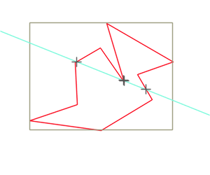

### 4.4 - Constructors

Four constructors are provided:
* one without arguments, that initializes the matrix to a unit transformation;
* one with **one** floating point argument, that produces a rotation matrix of the given angle value;
* one with **two** floating point arguments, that produces a translation matrix with the given values;
* the last one can be used to fill the matrix with a 2-dim container
(`std::vector<std::vector<numeric_type>>` or `std::array<std::array<numeric_type,3>,3>`).

```C++
Homogr Hr( 1. ); // rotation matrix of 1 radian
Homogr Ht( 3., 4. ); // translation matrix of tx=3, ty=4
std::array<std::array<numeric_type,3>,3> ar;
// ... fill array
Homogr Ha( ar );
```

### 4.5 - Computing from 2 sets of 4 points
<a name="H_4points"></a>

You can also compute the transformation from two sets of 4 (non-colinear) points:

```C++
std::vector<Point2d> v1(4); // "from" points
std::vector<Point2d> v2(4); // "to" points
... // fill v1 and v2
H.buildFrom4Points( v1, v2 );
auto H2 = buildFrom4Points( v1, v2 ); // or use the free function
```

For example, the following code:
```C++
	std::vector<Point2d> v1 { {20,20}, {250,20}, {230,170}, {60,190} };
	std::vector<Point2d> v2 { {60,60}, {280,50}, {220,150}, {90,130} };
	auto H = buildFrom4Points(v1, v2);
	std::cout << H;
```
will produce this matrix:
```
| 0.347509   0.140962     48.967  |
| -0.147718  0.510036     51.4901 |
| -0.0021031 0.00105012    1      |
```

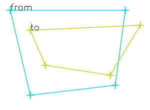


However, this requires the solving of a linear system of 8 equations with 8 unknowns (i.e. computing the inverse of a 8x8 matrix).
This task does not enter in the scope of this library, thus we rely on others ones to do this.
The consequence is that this feature is **ONLY AVAILABLE** if one of the two options below are available on system at build time.

The two options available are:
- Opencv (https://opencv.org)
- Eigen (https://eigen.tuxfamily.org/)

The default is Opencv, thus it will fail to build if not installed on system (check out [bindings](#bind) for more on this).
However, if none of these are installed on you system, the easiest to install is with no doubt Eigen, as it is a header-only library.

The member function `buildFrom4Points()` accepts as third argument an `int`, 0 means using Opencv, 1 means using Eigen.

## 5 - Intersections and enclosings determination
<a name="inter"></a>

### 5.1 - Intersections between primitives

This library has a homogeneous API for all intersections between the provided geometrical primitives.
That is, whatever `a` and `b` (excepts points of course), there is a member function `intersects()` that both
gives the answer to the question "do theses primitives intersect?" but also provides the intersections points.

If you are only interested in the first answer, you can write:

```C++
	if( a.intersects(b)() )  // or b.intersects(a)()
	 ... then do something
```

If you need the intersection points, then just store the returned value:
```C++
	auto res = a.intersects(b);  // or b.intersects(a)
	if( res() )           // does intersect !
	{
		std::cout << "number of intersections: " << res.size() << '\n';
		auto pts = res.get(); // get the points
	}
```

The number of intersection points will depend on the primitives, thus the access method (`get()`) will return different types.
It will also throw if there is no intersection!
And whatever the primitives, you can always get the number of intersection points with the `size()` member function.

The table below summarizes the number of intersection points to expect:

|            | `Line2d` | `Segment` | `FRect`  | `Circle` | `Polyline` |
|------------|----------|-----------|----------|----------|------------|
| `Line2d`   |  0 or 1  |           |          |          |            |
| `Segment`  |  0 or 1  |   0 or 1  |          |          |            |
| `FRect`    |  0 or 2  |   0,1,2   |    0-4   |          |            |
| `Circle`   |  0 or 2  |   0,1,2   |   0,2,4  |  0 or 2  |            |
| `Polyline` |  0 - n   |   0 - n   |   0 - n  |  0 - n   |   0 - n    |

- For line-line and line-segment intersections, the `get()` member function will return the unique intersection point, or throw if none.
- For line-circle or line-FRect, intersections, the `get()` member function will return the two intersection points as a `std::pair`, or throw if none.
- For the other situations, the `get()` member function will return a `std::vector` holding the points (empty if no intersections).

For `Polyline`, the number of intersections is of course depending on the number of segments.

See the provided demo for a runnable example (relies on Opencv backend).

For the functions returning a pair of points, the returned pair will always hold as "first" the point with the lowest `x` value,
and if equal, the point with the lowest `y` value.

For details on the algorithms involved, check [this page](homog2d_algorithms.md).

### 5.1.1 - Details on intersections

When a segment has a point lying on another segment, such as in the figure below, this will be considered as an intersection point:

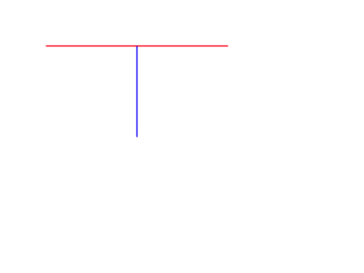

This has a consequence on rectangle intersections: when the rectangles are overlapping such as the figure below, we will have here **4** intersection points.


Similarly, in the situation as in the figure below, we will have **2** intersection points:


### 5.2 - Enclosing determination

This library provides an answer to the question: "is this object inside this other object?", whatever their type.
In many cases, the question doesnt really make any sense (a point cannot be inside a point, nor can a line be inside a segment),
but to have a homogeneous interface, the code `a.isInside(b)` will always compile.
In the nonsense situations described above, it will simply return false (as a `constexpr` value).

**Note**:
these functions use a strict condition: if point is on an edge, it will **not** be considered as inside the other object.

The table below summarizes what type (lines) can be used to check if it is inside another object of same or different type (columns).
 * F: (constexpr) false
 * T/F: true or false
 * NI: Not Implemented (yet), returns false

|           | Point2d | Line2d | Segment | Frect | CPolyline | OPolyline | Circle | Ellipse |
|-----------|---------|--------|---------|-------|-----------|-----------|--------|---------|
| Point2d   |    F    |    F   |    F    |  T/F  |    T/F    |     F     |   T/F  |   T/F   |
| Line2d    |    F    |    F   |    F    |   F   |     F     |     F     |    F   |    F    |
| Segment   |    F    |    F   |    F    |  T/F  |    T/F    |     F     |   T/F  |   T/F   |
| FRect     |    F    |    F   |    F    |  T/F  |    T/F    |     F     |   T/F  |   T/F   |
| CPolyline |    F    |    F   |    F    |  T/F  |    T/F    |     F     |   T/F  |   T/F   |
| OPolyline |    F    |    F   |    F    |  T/F  |    T/F    |     F     |   T/F  |   T/F   |
| Circle    |    F    |    F   |    F    |  T/F  |    T/F    |     F     |   T/F  |    NI   |
| Ellipse   |    F    |    F   |    F    |  T/F  |    T/F    |     F     |   T/F  |    NI   |


### 5.3 - Union and Intersection area of two rectangles

You can compute the rectangle corresponding to the intersection of two (flat) rectangles:
one can use either the `intersectArea()` member function or (same name) free function, or the `&` operator.
This will return an object that can be checked for with the `()` operator (returns a bool).
It will return `false` if there is no intersection.

For the union of two rectangles, the usage is similar, but it will return a (closed) `Polyline` object.
You may use either the `unionArea()` (member or free) function, or the `|` operator.

Additionaly, the `getBB()` free function returns the bounding box holding the two rectangles, as shown in gray in the two examples below.

```C++
auto a1 = r1.intersectArea(r2);
auto a2 = r1 & r2;
auto a3 = intersectArea( r1, r2 ); // free function
if( a1() )
	std::cout << "common area is " << a1.get(); // prints the FRect object of the intersection
auto b1 = r1.unionArea( r2 );
auto b2 = r1 | r2;
auto b3 = unionArea( r1, r2 ); // free function
```


Note that we may not have an intersection area **even** if there are some intersection points found, because these can be due to a shared segment,
or a single intersection point.<br>
For the union, if there is no intersection, the function will return an empty `CPolyline` object.

## 6 - Misc. features
<a name="misc"></a>

### 6.1 - Convex Hull

You can compute the convex hull of a set of points or of a `CPolyline` of `OPolyline` with `convexHull()`,
available as free or member function.
This function will return a `CPolyline` object.
```C++
std::vector<Point2d> vec;
// ... fill with at least 3 points
auto ch1 = convexHull( vec );
CPolyline pl( vec );
auto ch2 = convexHull( pl ); // will be the same as ch1
auto ch3 = pl.convexHull(); // member function
```

### 6.2 - Bounding Box of a set of points

You can compute the Bounding Box of a set of points.
This function will return a `Frect_` object:

```C++
std::vector<Point2d> vec;
// ... fill with at least 2 points
auto bb = getBB( vec );
draw( img, vec );
bb.draw( img );
```

The set must have at least 2 (distinct) points, else this function will throw.


### 6.3 - Colinearity of 3 points

You can check if three points lie on the same line with this:
```C++
bool b = areColinear( pt1, pt2, pt3 );
```


### 6.4 - Extracting data from sets/containers of primitives

If you have a `std::vector<Segment>` named `v_segs`, then the following function calls:

- `auto v_pts   = getCenters( v_segs );`
- `auto v_lines = getLines( v_segs );`

will return a vector holding the middle points of all the segments and a vector holding the supporting lines of all the segments.


## 7 - Bindings with other libraries
<a name="bind"></a>

Import from other types is pretty much straight forward.
For points, a templated constructor is provided that can be used with any type having an 'x' and 'y' member.
For example, say you have a point type:
```C++
struct MyPoint
{
	float x,y;
};
```
Then you can build a point (or a line going through (0,0) and that point) with:
```C++
MyPoint myPoint;
Point2d pt(myPoint);
Line2d li(myPoint);
```
But in case your type uses other identifiers than `x` and `y`, no problem:
just define the symbol `HOMOG2D_BIND_X` and `HOMOG2D_BIND_Y` with the ones you use and the above code will be ok.

For homographies, you can import directly from
`std::vector<std::vector<T>>` or `std::array<std::array<T,3>,3>`.

For the first case, it is mandatory that all the vectors sizes are equal to 3
(the 3 embedded ones and the global one).

### 7.1 - Data conversion from/to Opencv data types

Optional functions are provided to interface with [Opencv](https://opencv.org).
These features are enabled by defining the symbol `HOMOG2D_USE_OPENCV` at build time, before "#include"'ing the file.
You can then write this:
```C++
Point2d pt;
...
cv::Point2d ptcv1 = pt.getCvPtd(); // double coordinates
cv::Point2f ptcv2 = pt.getCvPtf(); // float coordinates
cv::Point2i ptcv3 = pt.getCvPti(); // integer coordinates
```

Or use the templated version:
```C++
auto ptcv1 = pt.getCvPt<cv::Point2d>(); // double coordinates
auto ptcv2 = pt.getCvPt<cv::Point2f>(); // float coordinates
auto ptcv3 = pt.getCvPt<cv::Point2i>(); // integer coordinates
```

This is also available as free functions:
```C++
Point2d pt;
...
cv::Point2d ptcv1 = getCvPtd(pt);
cv::Point2f ptcv2 = getCvPtf(pt);
cv::Point2i ptcv3 = getCvPti(pt);
...
auto ptcv3 = getCvPt<cv::Point2d>(pt); // templated version
```

Reverse operation as simple as this:
```C++

cv::Point2d ptcv(4,5);
Point2d pt1(ptcv);      // using constructor
Point2d pt2 = ptcv;     // or assignment operator
```
(works the same for `cv::Point2f` and `cv::Point2i`)

Similarly, you can build a line using Opencv points:
```C++
cv::Point2d ptcv(4,5);
Line2d l1( ptcv );                     // line going trough (0,0) and (4,5)
Line2d l2( ptcv, cv::Point2d(8,9) );   // line going trough (4,5) and (8,9)
```

This also enables conversions between matrices types.
You can build a homography using a provided `cv::Mat`:
```C++
cv::Mat m;   // needs to be 3x3, floating point type (either CV_32F or CV_64F)
... // fill m
Homog H = m;  // call of dedicated constructor
H = m;        // or call assignment operator
```

## 8 - Drawing
<a name="drawing"></a>

This library provides a way to render data graphically, using two backends.
However please note that this is not a "high-end" drawing tool, the rendering has no
extended fine-tuning on how things are rendered, it is there only to quickly see what is going on.

### 8.1 - Available backends

The user can select between two backends, both can be usable at the same time.
They both are accessed through the templated datatype `Image`, lying in the sub-namespace `img`.

The two concrete types can be used are either `img::SvgImage`, to generate a SVG file, and Opencv `cv::Mat` type,
that requires that the symbol `HOMOG2D_USE_OPENCV` is defined and that the library is installed on system.

The difference between these two backends is that with SVG, you may only generate a file;
with OpenCv, you can build an interactive app, through the "HighGui" part of that library, whith mouse and keyboard callbacks.
This is demonstrated in a [provided demo program](../misc/demo_opencv.cpp) that you can try with:
```
$ make demo
```
This requires that Opencv is installed on your machine.
In case you have some trouble building this program, please [read this](opencv_notes.md).

To have an idea, here are two renderings of the same objects done with the two backends
(done with [this program](../misc/figures_src/src/comparison_svg_opencv.cpp).)

 * with SVG:

  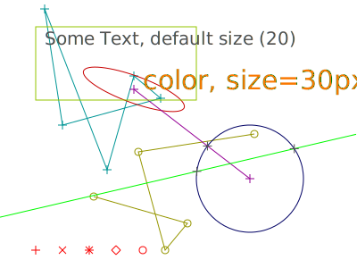

 * with OpenCv:

 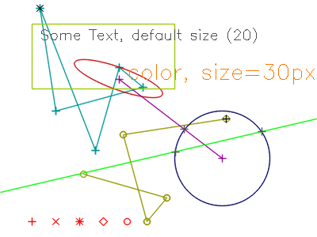


### 8.2 - Drawing objects

Generic drawing member functions are provided for all the types.
For example, creating a SVG file in current folder, holding a circle:
```C++
img::Image im1( 300, 400 ); // 300 x 400 pixels
Circle c1( 100,100,80 );
c1.draw( im1 );
im1.write( "circles1.svg" );
```

Same, using Opencv to create a png file:
```C++
img::Image<cv::Mat> im2( 300, 400 );
Circle c2( 100,100,80 );
c2.draw( im2 );
im2.write( "circles2.png" );
```

A corresponding free function is available, can be used for any type:
```C++
Point2d pt(100,100);
Circle c( pt,80 );
draw( img, c );
draw( img, pt );
```
If you use Opencv, you might need the `cv::Mat` object for other tasks.
It is available with the `getReal()` member function that returns a reference on that object (`const` or not):
```C++
img::Image<cv::Mat> img( 300, 400 );
cv::Mat& ocv = img.getReal()
```

### 8.3 - Drawing parameters
<a name="drawing_params"></a>

All these drawing functions support a second (or third, for the free function) optional argument of type `img::DrawParams` (also back-end library independent)
that holds various parameters for drawing.
So you can for example set the color and line width with:
```C++
li.draw( img, img::DrawParams().setThickness(2 /* pixels */).setColor(r,g,b) );
```
with r,g,b as bytes (`uint8_t`) in the range [0,255].

A local type holding these 3 values can also be used:
```C++
auto c = img::Color(255,0,222);
li.draw( img, img::DrawParams().setColor(c) );
```

The drawing parameters default values can be changed anytime with a call to `setDefault()`,
and values will be retained, unless explicitely changed, as showed in the example below;

```C++
img::DrawParams dp;                                        // default line thickness is 1
dp.setColor( 0,  0, 250 ).setThickness(3);
dp.setDefault();                                        // default is now blue, with thickness=3
line.draw( img );                                  // use default settings (blue,...)
line.draw( img. img::DrawParams().setColor( 0,0,0) ); // warning, black, but line thickness=3 !
```

You can at any time return to the "factory" settings with a call to a static function:
```C++
img::DrawParams::resetDefault();
```

You can also save a style in a variable, to avoid lengthy lines:
```C++
auto color_red = img::DrawParams().setColor( 250, 0, 0 );
something.draw( img, color_red );
```

The available functions are given in the table below:
     Function     |    Arguments     | Comment |
------------------|------------------|---------|
`setColor()`      | 3 ints ([0-255]) |  |
`setColor()`      |  `img::Color`    |  |
`setPointStyle()` | enum `PtStyle`: `Plus`,`Times`,`Star`,`Diam`,`Dot` |  |
`setPointSize()`  |  1 int (pixels)  |  |
`setThickness()`  |  1 int (pixels)  |  |
`showPoints()`    | bool (default is `true`) | Draws the points for<br>Segment and Polyline |

### 8.4 - Drawing containers

If you have a container (`std::vector`, `std::array` or `std::list`) filled with one of the primitives
or a `std::pair` of primitives (can be different types),
you can draw them at once with a call to the same function:
```C++
std::vector<Segment> vseg;
// ... fill vseg with data
std::pair<Circle,FRect> pair;
// ... fill the pair
draw( img, vseg );      // use default parameters
draw( img, vseg, dp );  // pass some drawing parameters
draw( img, pair );      // draw the pair circle, rectangle
draw( img, pair, dp );  // you can even pass drawing parameters
```

For containers, a second generic function is provided that has as third argument a `std::function`.
This is useful to enable having different drawing properties (think: color) for each element of the set:
```C++
void draw( img::Image<U>& img, const T& cont, std::function& func )
```

The passed function must return a valid `img::DrawParams` object.
It may be build depending on the index of the object.

A typical example would be:
```C++
std::vector<Segment> vseg;
/// fill vseg with data
std::vector<Color> vcol( vseg.size() );
/// fill vcol with colors

auto fl = [&](int i)   // lambda
{
	return img::DrawParams().setColor( vcol[i] );
};
std::function<DrawParams(int)> func(fl);
draw( img, vseg, func );
```

## 9 - Numerical data types
<a name="numdt"></a>

### 9.1 - Underlying data type

The library is fully templated, the user has the ability to select for each type either
`float`, `double` or `long double` as underlying numerical datatype, on a per-object basis.

The default datatype used for all the primitives
(`Point2d`, `Line2d`, `Homogr`, `Segment`, `FRect`, `Circle`, `Polyline`, `Ellipse`)
 is `double`.
The other types can be selected by an additional suffix letter added after the type:

`F` for `float`, `D` for `double` and `L` for `long double`.

For example: `Point2dF`, `Line2dF` or `SegmentF` are float types.

If you prefer the classical template notation, it is also available by adding an underscore after the type:

```C++
Point2d_<float> ptf;
FRect_<double> rectd;
Segment_<long double> sld;
```

However, this only applies to **storage**.
All the computation (distances, angles, intersections, ...) use (and returns)
the type defined by symbol `HOMOG2D_INUMTYPE`, that defaults to `double`.

If you need extra precision (and if your compiler supports it), you may
configure the library to use `long double` by adding this before the "include":
```C++
#define HOMOG2D_INUMTYPE long double
```
or add that as a compile flag: `$(CXX) $(CXXFLAGS) "-DHOMOG2D_INUMTYPE long double" ...`
<br>(don't forget the quotes!)

#### Numerical type access

For any object, you may know its type with the `dtype()` (member or free) function.
It will return an enum value of type `Dtype`, either
`Dtype::Float`, `Dtype::Double` or `Dtype::LongDouble`.

```C++
Circle c1;
assert( c1.dtype() == Dtype::Double );
CircleF c2;
assert( dtype(c2) == Dtype::Float );
```

### 9.2 - Numerical type conversion

It is possible to convert to/from an object templated by a different type (at the cost of a potential precision loss):
```C++
Point2dD pt_double;
Line2dL  li_long;
Point2dF pt_float  = pt_double;
Line2dD  li_double = li_long;
SegmentD sd;
SegmentL sl = sd;
```

### 9.3 - Numerical issues
<a name="num_issues"></a>

For the tests on null values and floating-point comparisons, some compromises had to be done.
As you may know, the concept of "equal floating point values" is very tricky.
In this library, this can hurt in several ways:
 - creating a line from two points will fail if the points are equal,
 - similarly, computing a point at the intersection of two lines will fail if the lines are parallel.

This library will ensure these conditions, and will throw an exception (of type `std::runtime_error`) if that kind of thing happens.
The thresholds all have default values.
They are implemented as static values, that user code can change any time.

More details and complete list on [threshold page](homog2d_thresholds.md).

## 10 - SVG import
<a name="svg_import"></a>

### 10.1 - Requirements

A minimal SVG import code is present, it relies on the well-known
[tinyxml2](https://github.com/leethomason/tinyxml2)
library, thus it needs to be present on machine to build an application using this feature.

On Debian-based distros, this can be easily done with
`$ sudo apt install libtinyxml2-dev`

To enable its usage in your code, you need to do two things:
* define the symbol `HOMOG2D_USE_SVG_IMPORT` before including `homog2d.hpp`
* add the library to the compile line.
That can be done by adding this to the linking command-line:
```
$(pkg-config --libs tinyxml2)
```
(double the `$` if in a makefile)

### 10.2 - Example

Importing is pretty simple:
Instanciate a Tinyxml `XMLDocument` object, and use it to read the file.
Then create a "visitor" object, and fetch a vector of the objects in the file:
```C++
tinyxml2::XMLDocument doc;
doc.LoadFile( "filename.svg" );

h2d::svg::Visitor visitor;
doc.Accept( &visitor );
auto data = visitor.get();
```

The latter function returns a vector of polymorphic (smart) pointers (`std::unique_ptr`) of type `priv::Root`.
You can determine the actual type of the object by using the abstract `type()` function.
It will return an enum value of type `Type` having one of these values:<br>
`Segment, FRect, Circle, Ellipse, OPolyline, CPolyline`

There are three polymorphic functions available: `draw()`, `length()`, and `area()`.
And you can get a human-readable value ot the object type with `getString(Type)`:

```C++
for( const auto& p: data )
{
	p->draw( image );
	std::cout << "Element is a " << getString( p->type() )
		<<", length=" << p->length() << ", area=" << p->area() << '\n';
}
```

You can use the type information to convert the pointer into the right type:

```C++
for( const auto& p: data )
{
	if( p->type() == Type::Circle )
	{
		const Circle* c = static_cast<Circle*>( p.get() );
		std::cout << "circle radius=" << c->radius() << '\n';
	}
}
```

### 10.3 - Technical details on svg file import

When importing a SVG file, the following points must be considered:

* All the color, style,etc. Svg attributes present in file are lost, as this library does not store them.
* All groups (`<g>` tags) are ignored.
* Svg has no "line" object, what is called a line is actually a segment and it will be imported as such.
* Svg has no "point" object, thus it cannot be imported.
However, if you try to import a file that was created with the Svg drawing subsystem, points will be plotted with a shape defined by
[its parameters](#drawing_params).
* Svg has two ways to define a polyline (or polygon):
either with the dedicated keywords
([`polyline`](https://www.w3.org/TR/SVG2/shapes.html#PolylineElement)
or [`polygon`](https://www.w3.org/TR/SVG2/shapes.html#PolygonElement)), or by using the
[`path`](https://www.w3.org/TR/SVG2/paths.html#PathElement) element, that is much more general.
At present this import subsystem only handles the `polyline` and `polygon` elements.

SVG Reference: https://www.w3.org/TR/SVG2/shapes.html

### 10.4 - Demo

If you have cloned the whole repo and have `Tinyxml2` installed, you may build a demo program with:
<br>
`$ make demo_import`

This will build the file `BUILD/demo_svg_import` that can import any SVG file, print its content on screen
and generate another svg file `test.svg` in current folder.

For example:
<br>
`$ BUILD/demo_svg_import docs/img/comparison_1.svg`


## 11 - Technical details
<a name="tech"></a>

- The two types `Point2d` and `Line2d` are actually two typedefs of class `LPBase`,
behavior differs due to some policy-based design.
Similarly, the types `CPolyline` and `OPolyline` (Closed and Open polyline) are specializations of the root class `PolylineBase`.
- Points are stored as non-normalized values, any computation will keep the resulting values.
Normalization is done for comparison but not saved.
- Lines are always stored as normalized values (a^2+b^2 = 1)
- Homographies are stored as normalized values, either as h33=1, or (if null) as h23=1, or (if null) as h13=1

For more details on the code, check [this page](homog2d_devinfo.md).

### 11.1 - Testing

A unit-test program is included.
It is uses the [Catch2](https://github.com/catchorg/Catch2) library.
The travis-based CI loads the 2.13.6 release.
It is build and run with `$ make test`.
It has been tested both with gcc7.5 (Ubuntu 18) and gcc9.4 (Ubuntu 20).

If you have Opencv installed on your machine, you can run the additional tests that make sure the Opencv binding stuff runs fine by passing make option `USE_OPENCV=Y`:
```
make test USE_OPENCV=Y
```

Similarly, if you have Tinyxml2 installed, you can run the additional SVG import tests by passing this flag:
```
make test USE_TINYXML2=Y
```

A second test target is included: `$ make testall`.
It will build and run the test program 3 times, one for each numerical data
type (`float`, `double`, and `long double`), through the symbol `HOMOG2D_INUMTYPE`.

The test target also attempts to build the files in the folder `misc/no_build`.
These demonstrate some code that should NOT build, thus Make will fail if any of these does build.
This is just to make sure that some invalid code does, indeed, not build.

**Timing**
Using the Catch library has a small drawback: build time is pretty long (but will succeed!).
For example:
```
$ time make test -j2
real   0m41,986s
user   1m21,940s
sys    0m1,699s
```

### 11.2 - Build options
<a name="build_options"></a>

Below are some options that can be passed, to activate them, just define the symbol.
You can do that in the makefile by adding `-DHOMOG2D_SYMBOL` to the compiler call options,
or just add a `#define` on top of your program
**before** the `#include "homog2d"`

- `HOMOG2D_USE_OPENCV`: enable the Opencv binding, see [Bindings](#bind).
- `HOMOG2D_USE_EIGEN`: enable the Eigen binding, useful if you need to compute a homography from points and Opencv not available
(see [here](#H_4points)).
- `HOMOG2D_USE_SVG_IMPORT` : enables importing from svg files, requires `Tinyxml2` library, see [SVG import](#svg_import).
- `HOMOG2D_NOCHECKS`: will disable run-time checking.
If not defined, incorrect situations will throw a `std::runtime_error`.
If defined, program will very likely crash.
- `HOMOG2D_OPTIMIZE_SPEED`: this option may be useful if you intend to to a lot of processing with ellipses, and you favor speed over memory.
The default behavior for class `Ellipse` is to store only the homogeneous matrix representation (conic form),to minimize memory footprint.
This drawback is that every time we need to access some parameter (say, center point), a lot of computations are required to get back to the "human-readable" values.
With this option activated, each ellipse will store both representations, so access to values is immediate.
For more on this, [see this page](homog2d_speed.md).

- `HOMOG2D_DEBUGMODE`: this will be useful if some asserts triggers somewhere.
While this shoudn't happen even with random data, numerical (floating-point) issues may still happen,
[read this for details](homog2d_qa.md#assert_trigger).


