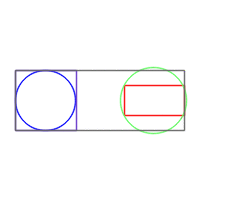
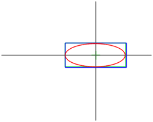
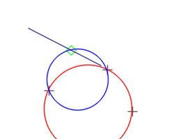
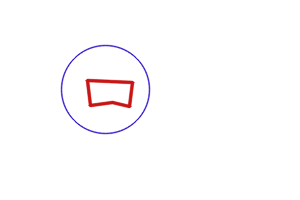

# Graphical showcase

[Manual main page](homog2d_manual.md)

On this page, some graphical demos, all generated with programs in misc/showcase, with `$ make showcase`
 
Requires Opencv (to generate images) and ImageMagick (to generate the final gif).

* [Showcase 1](../misc/showcase/showcase1.cpp):The front page demo. The moving circle turns red when it is detected as inside the rectangle or the other circle.

* [Showcase 3](../misc/showcase/showcase3.cpp):
A rotating Polyline object, its bounding box, and its intersection with a line.

* [Showcase 4](../misc/showcase/showcase4a.cpp):
Two dancing objects (Circle and FRect) and their common bounding box.
Also show the rectangle's bounding circle and the circle's bounding box.

* [Showcase 2a](../misc/showcase/showcase2a.cpp) and [Showcase 2b](../misc/showcase/showcase2b.cpp):

Intersection and union areas of two rectangles.

* [Showcase 5](../misc/showcase/showcase5.cpp):
A rotating ellipse with its center point (green), its axis lines, and its two bounding boxes (one aligned with its axis, the other xy-aligned).

* [Showcase 6](../misc/showcase/showcase6.cpp):
Building circles from two (blue) or three (red) points, with one of the points rotating in the image.
Also shows intersection of circles with a segment.

* [Showcase 7](../misc/showcase/showcase7.cpp):

A demo showing when a closed polyline and a circle can be inside each other.
Red and bold drawing when inside the other.
Also shows the intersection points between these two primitives.

* [Showcase 8](../misc/showcase/showcase8.cpp):

A rotating point, a fixed segment and a fixed line.
The blue segment is generated between the point and the line, using `getOrthogSegment()`.
The other segment shows the distance between the point and the fixed segment, with two alternate colors showing the case (orthogonal distance or distance to segment edge).

